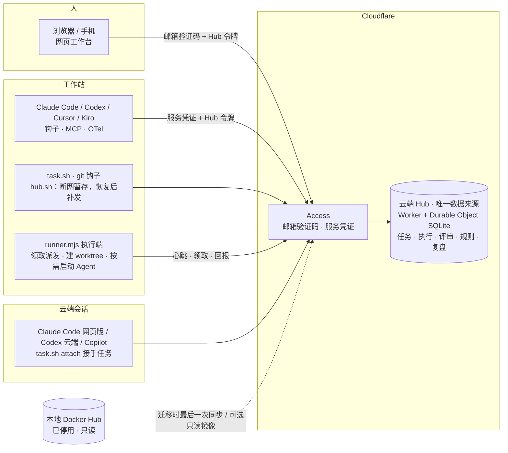
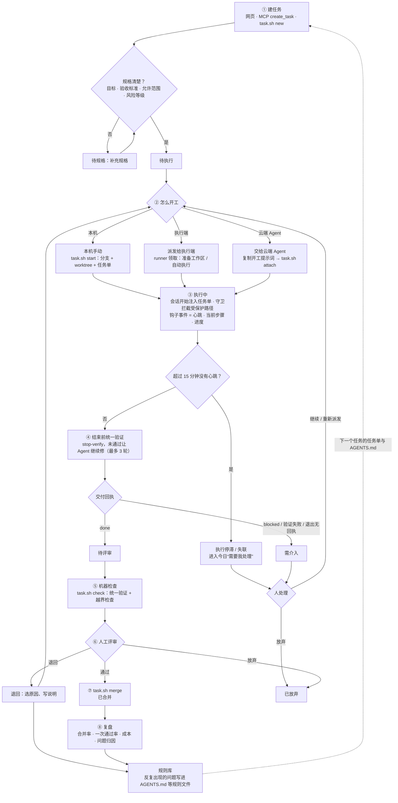
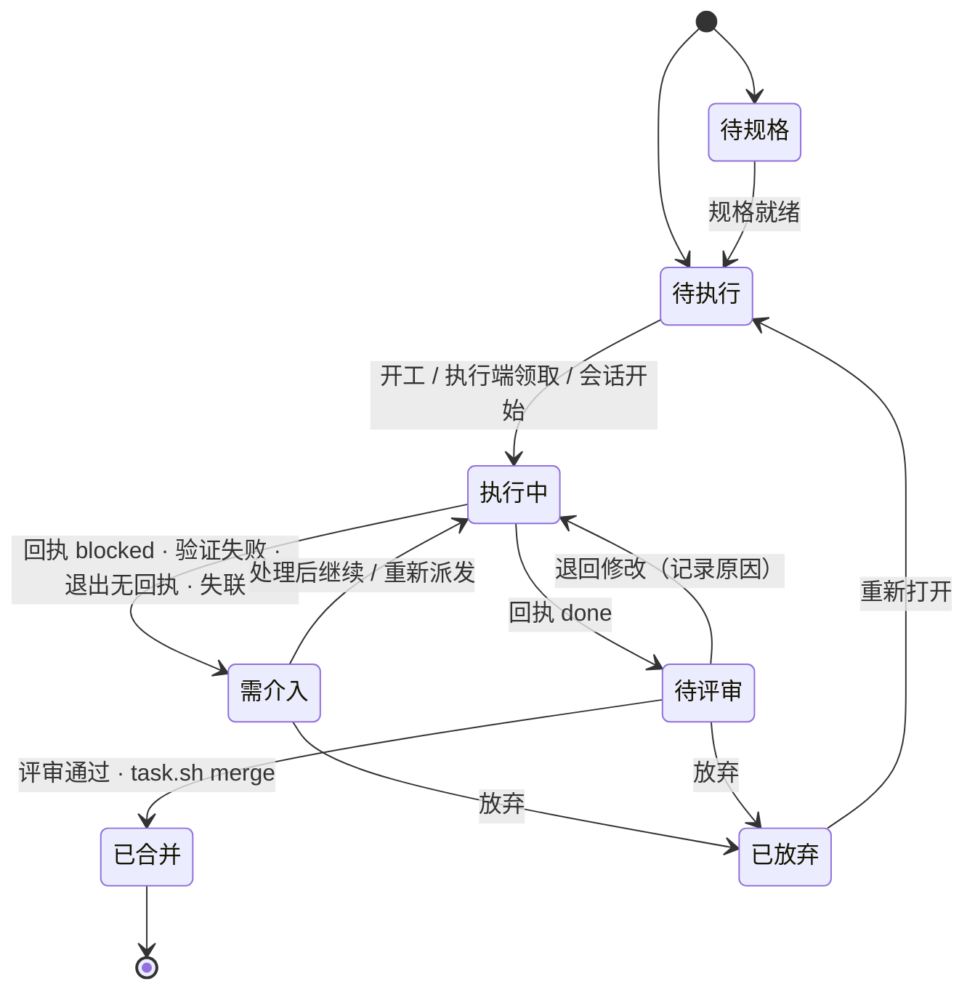
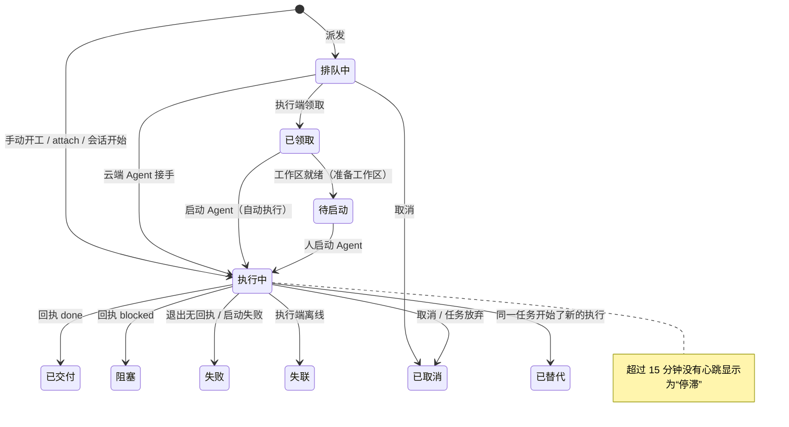
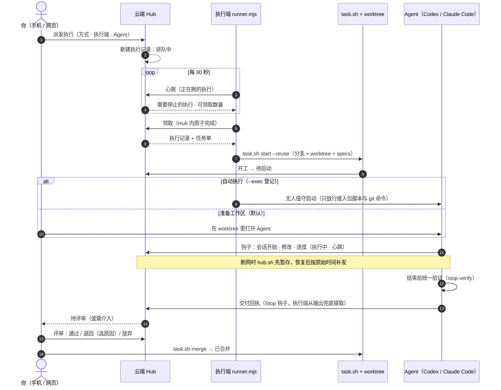
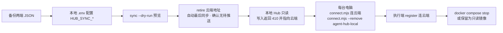

# 管理流程（云端唯一）

适用于 agent-hub 0.3.0。核对日期：2026-10-03。GitHub 会直接渲染下面的 Mermaid 图。

## 1. 总览：谁连到哪里

所有入口都连云端 Hub；本地 Docker Hub 退役为只读，只在迁移时做最后一次同步，或者留作只读镜像。

## 2. 一个任务的完整流程

从建任务到规则沉淀。菱形是需要判断的节点，虚线是经验回流到下一个任务。

## 3. 任务状态

## 4. 执行记录（一次执行尝试）

每个任务同一时间只有一个进行中的执行；退回后再开工是新的一次尝试。

## 5. 派发到执行端：一次完整交互

## 6. 迁移到云端唯一

详细命令见 [云端唯一：迁移与日常](CLOUD-ONLY.md)，机制见 [执行管理与多端同步](EXECUTION-AND-SYNC.md)。
